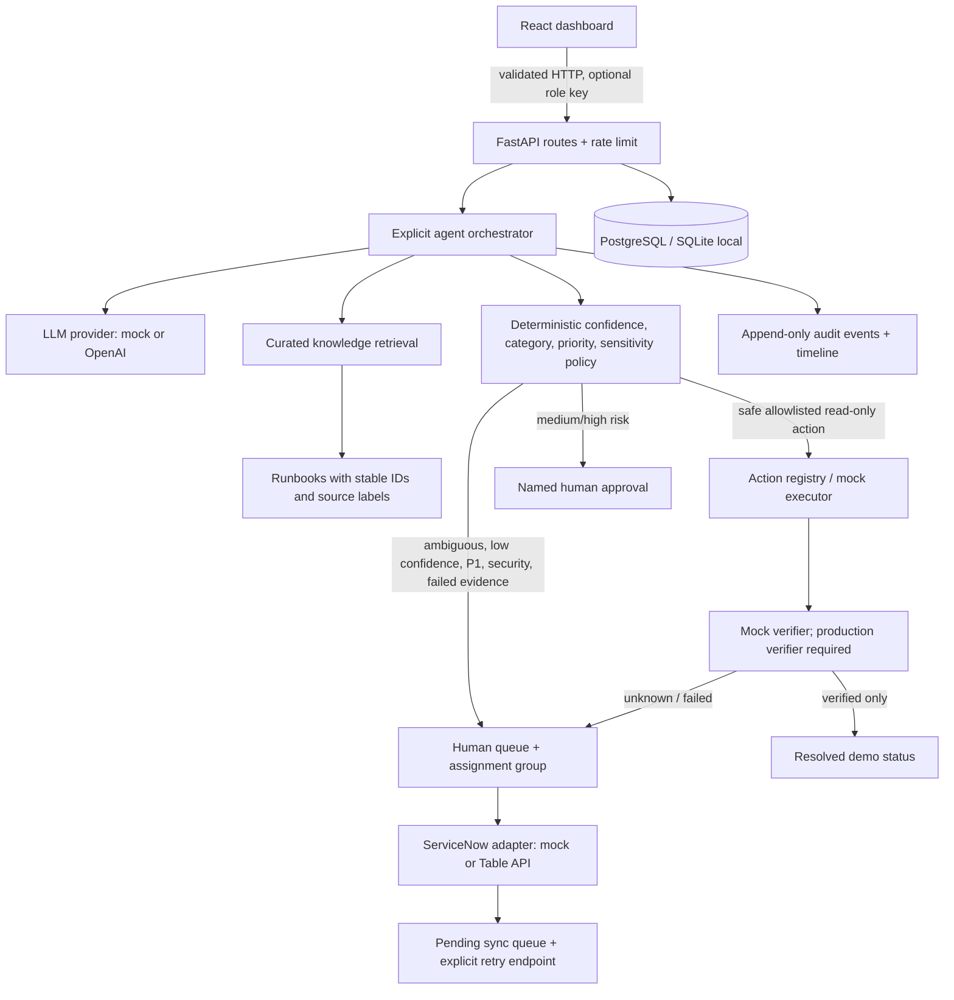

# Architecture and trust boundaries

## Control flow

1. API schema validates and bounds user-controlled incident text.
2. Provider returns a typed suggestion. Exceptions and malformed output fail to an uncertain result.
3. Local knowledge retrieval returns only curated documents with stable source IDs; source text is never interpreted as executable instructions.
4. Deterministic policy re-computes impact, urgency, and priority, validates category and thresholds, and forces human handling for security, P1, uncertainty, conflicting categories, or provider/knowledge outage.
5. The orchestrator can choose only names in the action registry. Medium/high risk registry actions are held until a named approval. No shell or arbitrary tool execution is exposed.
6. The local mock executor is non-mutating. Its verification is explicitly a simulation. A real integration must supply a trustworthy verification implementation before it can resolve live tickets.
7. Audit rows are append-only through the API and capture event payloads, sources, confidence, action outcomes, assignment, and escalation summary.

## Persistence and integration

SQLAlchemy models store incidents and audit events. Docker Compose uses PostgreSQL; direct development defaults to SQLite. The ServiceNow adapter is isolated from policy and orchestrator logic. Failed remote synchronization is marked `pending_retry`, and `POST /api/servicenow/retry-pending` retries using a correlation ID when supported.

`DASHBOARD_ADMIN_KEY` can authorize read/write routes and `DASHBOARD_VIEWER_KEY` authorizes reads only. Authentication is optional in the local mock default and must be configured before network exposure. Rate limiting is per-process and per-IP; a multi-instance deployment should replace it with a shared limiter and use enterprise SSO.
